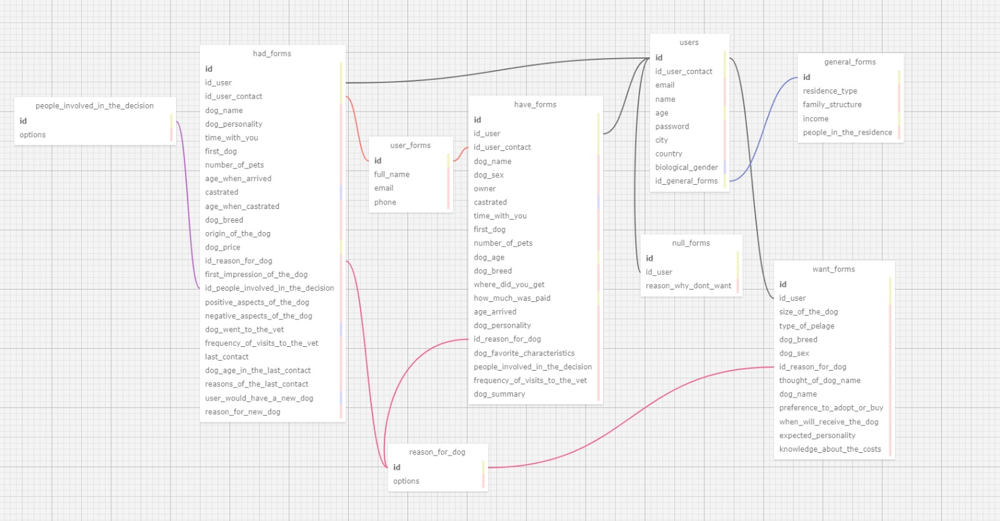

# Atividade-ModeloRelacional

**Projeto:** Abandono Zero

**Data:** 05/11/2024

**Autor:** Gabriel Bacci Toledo

**Objetivo:** Descrever o modelo relacional do projeto de forma resumida e simplificada.

&nbsp;&nbsp;&nbsp;&nbsp;
&nbsp;&nbsp;&nbsp;&nbsp;

## Introdução

&nbsp;&nbsp;&nbsp;&nbsp; Este documento descreve o modelo relacional simplificado para o projeto Abandono Zero, que visa coletar e gerenciar informações sobre usuários e suas relações com cães para analisar esses dados e poder ter base para um estudo sobre o abandono de cães.

&nbsp;&nbsp;&nbsp;&nbsp;
&nbsp;&nbsp;&nbsp;&nbsp;

## Imagens

 
<b>Modelo relacional</b>

<b>Ferramenta utilizada:</b> <a href="https://sql.toad.cz/">Sql Designer</a>.

 

&nbsp;&nbsp;&nbsp;&nbsp;
&nbsp;&nbsp;&nbsp;&nbsp;

## Entidades
&nbsp;&nbsp;&nbsp;&nbsp; **Usuários** ( <b>'users' </b> ): Armazena informações básicas sobre os usuários.
Tabela "users"
<ul>
    <li><b>'id'</b>: INTEGER, <b>Primary Key</b>. </li>
    <li><b>'id_user_contact'</b>: INTEGER, <b>Foreign Key</b> referenciando a tabela (<b>"user_forms"<b>). </li>
    <li><b>'email'</b>: VARCHAR(255). </li>
    <li><b>'name'</b>: VARCHAR(50). </li>
    <li><b>'age'</b>: SMALLINT.</li>
    <li><b>'password'</b>: VARCHAR(64). </li>
    <li><b>'city'</b>: VARCHAR(50). </li>
    <li><b>'country'</b>: VARCHAR(100). </li>
    <li><b>'biological_gender'</b>: Bit. </li>
    <li><b>'id_general_forms'</b>: INTEGER, <b>Foreign Key</b> referenciando a tabela (<b>"general_forms"<b>). </li>
</ul>
     
&nbsp;&nbsp;&nbsp;&nbsp;
&nbsp;&nbsp;&nbsp;&nbsp;

&nbsp;&nbsp;&nbsp;&nbsp; **Formulários** ( <b>'general_forms'</b> ): Detalhes gerais do usuário.
Tabela "general_forms"
<ul>
    <li><b>'id'</b>: INTEGER, <b>Primary Key</b>. </li>
    <li><b>'residence_type'</b>: VARCHAR(50). </li>
    <li><b>'family_structure'</b>: VARCHAR(100). </li>
    <li><b>'income'</b>: DECIMAL(10,2). </li>
    <li><b>'people_in_the_residence'</b>: VARCHAR(20). </li>
</ul>

&nbsp;&nbsp;&nbsp;&nbsp;
&nbsp;&nbsp;&nbsp;&nbsp;

&nbsp;&nbsp;&nbsp;&nbsp; **Formulários** ( <b>'have_forms'</b> ): Informações sobre o cão que o usuário possui.
Tabela "have_forms"
<ul>
    <li><b>'id'</b>: INTEGER, <b>Primary Key</b>. </li>
    <li><b>'id_user'</b>: INTEGER, <b>Foreign Key</b> referenciando a tabela (<b>"users"<b>). </li>
    <li><b>'id_user_contact'</b>: INTEGER, <b>Foreign Key</b> referenciando a tabela (<b>"user_forms"<b>) . </li>
    <li><b>'dog_name'</b>: VARCHAR(60). </li>
    <li><b>'dog_sex'</b>: BINARY.</li>
    <li><b>'owner'</b>: BINARY. </li>
    <li><b>'castrated'</b>: BIT. </li>
    <li><b>'time_with_you'</b>: VARCHAR(30). </li>
    <li><b>'first_dog'</b>: BINARY. </li>
    <li><b>'number_of_pets'</b>: VARCHAR(30). </li>
     <li><b>'dog_age'</b>: SMALLINT. </li>
     <li><b>'dog_breed'</b>: VARCHAR(60). </li>
     <li><b>'where_did_you_get'</b>: VARCHAR(50). </li>
     <li><b>'how_much_was_paid'</b>: DECIMAL. </li>
     <li><b>'age_arrived'</b>: VARCHAR(20). </li>
     <li><b>'dog_personality'</b>: VARCHAR(300). </li>
     <li><b>'id_reason_for_dog'</b>: VARCHAR(200). </li>
</ul>

&nbsp;&nbsp;&nbsp;&nbsp;
&nbsp;&nbsp;&nbsp;&nbsp;

&nbsp;&nbsp;&nbsp;&nbsp; **Formulários** ( <b>'had_forms'</b> ): Informações sobre o cão que o usuário já teve
Tabela "had_forms"
<ul>
    <li><b>'id'</b>: INTEGER, <b>Primary Key</b>. </li>
    <li><b>'id_user'</b>: INTEGER, <b>Foreign Key</b> referenciando a tabela (<b>"users"<b>). </li>
    <li><b>'id_user_contact'</b>: INTEGER, <b>Foreign Key</b> referenciando a tabela (<b>"user_forms"<b>) . </li>
    <li><b>'dog_name'</b>: VARCHAR(60). </li>
    <li><b>'dog_personality'</b>: VARCHAR(300).</li>
    <li><b>'time_with_you'</b>: VARCHAR(30) </li>
    <li><b>'first_dog'</b>: BINARY. </li>
    <li><b>'number_of_pets'</b>: VARCHAR(30). </li>
    <li><b>'age_when_arrived'</b>: VARCHAR(50). </li>
    <li><b>'castrated'</b>: BIT. </li>
     <li><b>'age_when_castrated'</b>: VARCHAR(50). </li>
     <li><b>'dog_breed'</b>: VARCHAR(60). </li>
     <li><b>'origin_of_the_dog'</b>: VARCHAR(60). </li>
     <li><b>'dog_price'</b>: DECIMAL. </li>
     <li><b>'id_reason_for_dog'</b>: VARCHAR(100). </li>
     <li><b>'first_impression_of_the_dog'</b>: TEXT. </li>
     <li><b>'id_people_involved_in_the_decision'</b>: VARCHAR(100). </li>
     <li><b>'positive_aspects_of_the_dog'</b>: TEXT. </li>
     <li><b>'negative_aspects_of_the_dog'</b>: TEXT. </li>
     <li><b>'dog_went_to_the_vet'</b>: BIT. </li>
     <li><b>'frequency_of_visits_to_the_vet'</b>: VARCHAR(60). </li>
     <li><b>'last_contact'</b>: VARCHAR(60). </li>
     <li><b>'dog_age_in_the_last_contact'</b>: VARCHAR(30). </li>
     <li><b>'reasons_of_the_last_contact'</b>: VARCHAR(200). </li>
     <li><b>'user_would_have_a_new_dog'</b>: BITL. </li>
     <li><b>'reason_for_new_dog'</b>: TEXT. </li>
</ul>

&nbsp;&nbsp;&nbsp;&nbsp;
&nbsp;&nbsp;&nbsp;&nbsp;

&nbsp;&nbsp;&nbsp;&nbsp; **Formulários** ( <b>'want_forms'</b> ): Informações sobre o cão que o usuário deseja ter
Tabela "want_forms"
<ul>
    <li><b>'id'</b>: INTEGER, <b>Primary Key</b>. </li>
    <li><b>'id_user'</b>: INTEGER, <b>Foreign Key</b> referenciando a tabela (<b>"users"<b>). </li>
    <li><b>'size_of_the_dog'</b>: VARCHAR(10). </li>
    <li><b>'type_of_pelage'</b>: VARCHAR(10). </li>
    <li><b>'dog_breed'</b>: VARCHAR(60).</li>
    <li><b>'dog_sex'</b>: BINARY. </li>
    <li><b>'id_reason_for_dog'</b>: VARCHAR(50). </li>
    <li><b>'thought_of_dog_name'</b>: VARCHAR(200). </li>
    <li><b>'dog_name'</b>: VARCHAR(60). </li>
     <li><b>'preference_to_adopt_or_buy'</b>: VARCHAR(10). </li>
     <li><b>'when_will_receive_the_dog'</b>: VARCHAR(80). </li>
     <li><b>'expected_personality'</b>: TEXT. </li>
     <li><b>'knowledge_about_the_costs'</b>: TEXT. </li>
</ul>

&nbsp;&nbsp;&nbsp;&nbsp;
&nbsp;&nbsp;&nbsp;&nbsp;

&nbsp;&nbsp;&nbsp;&nbsp; **Formulários** ( <b>'null_forms'</b> ): Motivo pelo qual o usuário não tem e não deseja ter um cão.
Tabela "null_forms"
<ul>
    <li><b>'id'</b>: INTEGER, <b>Primary Key</b>. </li>
    <li><b>'id_user'</b>: INTEGER, <b>Foreign Key</b> referenciando a tabela (<b>"users"<b>). </li>
    <li><b>'reason_why_dont_want'</b>: VARCHAR(300). </li>
</ul>

&nbsp;&nbsp;&nbsp;&nbsp;
&nbsp;&nbsp;&nbsp;&nbsp;

&nbsp;&nbsp;&nbsp;&nbsp; **Formulários** ( <b>'user_forms'</b> ): Informações de contato dos usuários.
Tabela "user_forms"
<ul>
    <li><b>'id'</b>: INTEGER, <b>Primary Key</b>. </li>
    <li><b>'full_name'</b>: VARCHAR(50). </li>
    <li><b>'email'</b>: VARCHAR(50). </li>
    <li><b>'phone'</b>: VARCHAR(30). </li>
</ul>

&nbsp;&nbsp;&nbsp;&nbsp;
&nbsp;&nbsp;&nbsp;&nbsp;

&nbsp;&nbsp;&nbsp;&nbsp; **Formulários** ( <b>'reason_for_dog'</b> ): Informação sobre o motivo de querer um cão.
Tabela "reason_for_dog"
<ul>
    <li><b>'id'</b>: INTEGER, <b>Primary Key</b>. </li>
    <li><b>'options'</b>: VARCHAR(200). </li>
</ul>

&nbsp;&nbsp;&nbsp;&nbsp;
&nbsp;&nbsp;&nbsp;&nbsp;

&nbsp;&nbsp;&nbsp;&nbsp; **Formulários** ( <b>'people_involved_in_the_decision'</b> ): Informação sobre as pessoas envolvidadas na decisão do nome do cão.
Tabela "people_involved_in_the_decision"
<ul>
    <li><b>'id'</b>: INTEGER, <b>Primary Key</b>. </li>
    <li><b>'options'</b>: VARCHAR. </li>
</ul>

&nbsp;&nbsp;&nbsp;&nbsp;
&nbsp;&nbsp;&nbsp;&nbsp;

## Regras de Negócio

- Todos os campos obrigatórios devem ser preenchidos.
- As informações devem ser consistentes entre os formulários.
- Os usuários não podem editar informações já salvas, exceto em casos específicos.
- As informações dos usuários são confidenciais.

&nbsp;&nbsp;&nbsp;&nbsp;
&nbsp;&nbsp;&nbsp;&nbsp;

## Considerações Finais

Este modelo relacional simplificado fornece uma base para o gerenciamento eficiente das informações dos usuários e suas respostas nos formulários do projeto Abandono Zero. As entidades, seus atributos e relacionamentos garantem a organização e a integridade dos dados. As regras de negócio garantem a consistência e a confiabilidade das informações.

&nbsp;&nbsp;&nbsp;&nbsp;

**Observações:**

- Este modelo é uma versão simplificada e pode ser adaptado às necessidades específicas do projeto.
- É importante documentar detalhadamente o modelo relacional para facilitar o entendimento e a manutenção do sistema.
- A implementação do modelo relacional deve seguir boas práticas de desenvolvimento de banco de dados.
